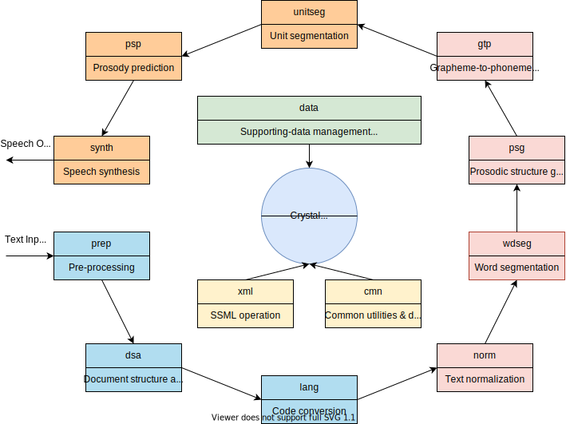
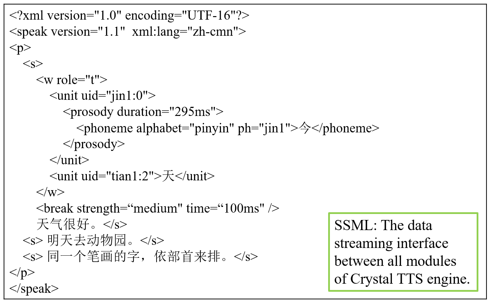
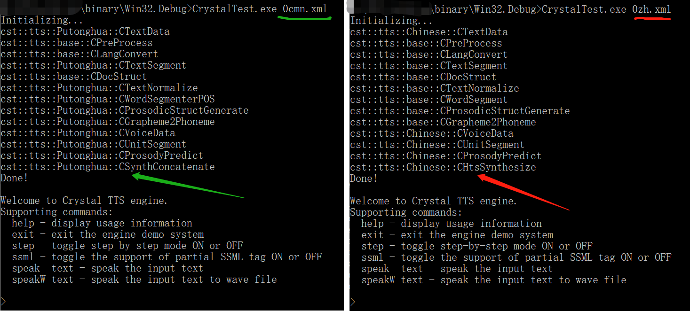
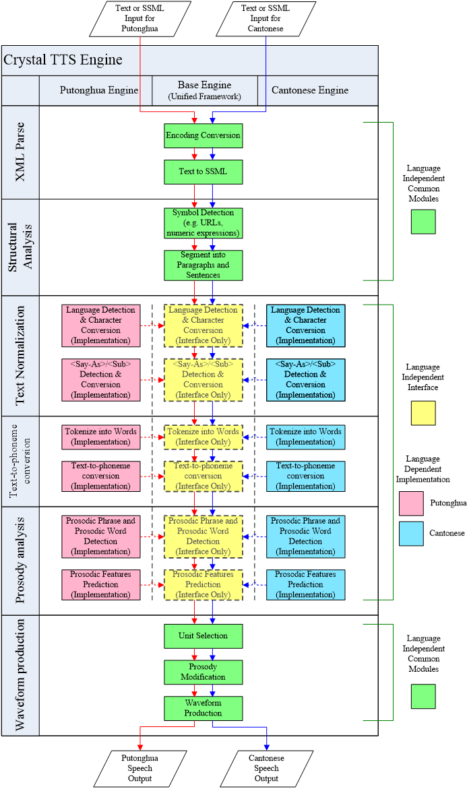

# Crystal Text-to-Speech (TTS) Engine

C++ implementation of Crystal Text-to-Speech (TTS) engine.

The Crystal TTS engine provides an implementation of a unified framework for multilingual TTS synthesis engine – Crystal.  The unified framework defines the common TTS modules for different languages and/or dialects.  The interfaces between consecutive modules conform to Speech Synthesis Markup Language (SSML) specification for standardization, in-teroperability, multilinguality, and extensibility.

### Architecture

  

### Reference
For the motivation and design of the framework, you can refer to the [the following paper](http://www1.se.cuhk.edu.hk/~hccl/publications/pub/2035_Unified%20Framework.pdf).  Please also use this paper for reference to this project:

- Zhiyong WU, Guangqi CAO, Helen MENG, Lianhong CAI, "[A Unified Framework for Multilingual Text-to-Speech Synthesis with SSML Specification as Interface](http://www1.se.cuhk.edu.hk/~hccl/publications/pub/2035_Unified%20Framework.pdf)," *Tsinghua Science and Technology*, vol. 14, no. 5, pp. 623-630, October 2009.

### Native Support of SSML

The framework uses Speech Synthesis Markup Language (SSML) specification as interface between different modules.  Hence, the framework provides native support of SSML tags.

Meanwhile, the framework provides **cst::xml::CSSMLTraversal** (*xml/ssml_traversal*) to convert the SSML document into internal data structure for convenient processing.  This means you actually donot need to take care of the complex parsing procedures of SSML document when implementing your own algorithms.  What you need to do is just to implement your algorithms by overriding the functions with internal data structures for the modules in **cst::tts::base::***.

  

 

### Support of Dynamic Module Loading & Cross-platform

The framework provides the support of dynamic module loading on different platforms.

You can implement different algorithms for each module and compile as a new dynamic library (.dll on Windows, .so on Linux platform).  The backbone of the framework **cst::tts::base::CTextParser** (*ttsbase/tts.text/tts_textparser*) and **cst::tts::base::CSynthesizer** (*ttsbase/tts.synth/tts_synthesizer*) will automatically load the modules specified by an XML based configuration file.  In this way, the framework provides the flexibility in switching between different TTS engines or algorithms.

  

 

For example, the above left figure shows Concatenative Putonghua TTS engine running by specifying the "cmn.xml" as configuration input; while the above right figure shows HMM-based Chinese TTS engine running by specifying the "zh.xml" as configuration input.

### Support of Multilingual TTS Engine

You can implement different TTS engines for different languages by overriding the TTSBase moduels in **cst::tts::base::***.  The following figure depicts the multilingual support of the architecture.

  

 

### About the Project

Copyright (c) Tsinghua-CUHK Joint Research Center for Media Sciences, Technologies and Systems. All rights reserved.

http://mjrc.sz.tsinghua.edu.cn

Tsinghua-CUHK Joint Research Center has the rights to create, modify, copy, compile, remove, rename, explain and deliver the source codes.
